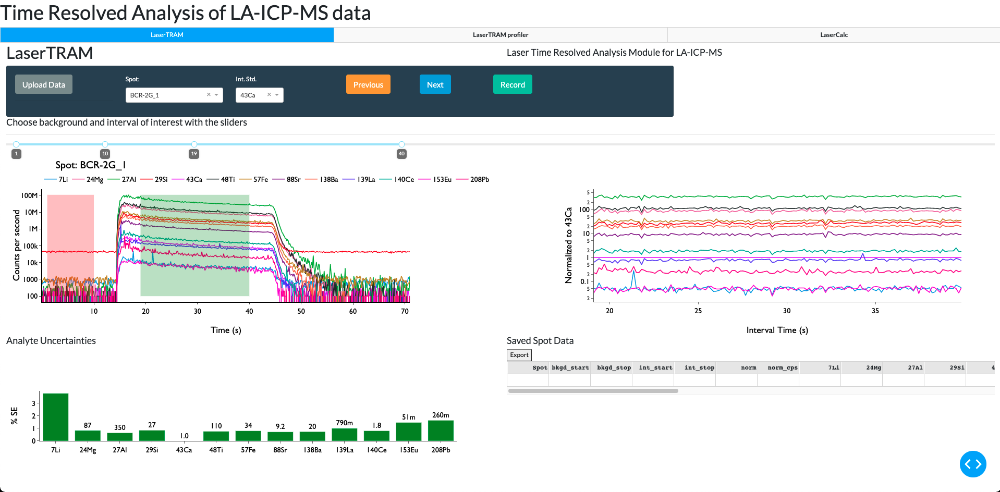
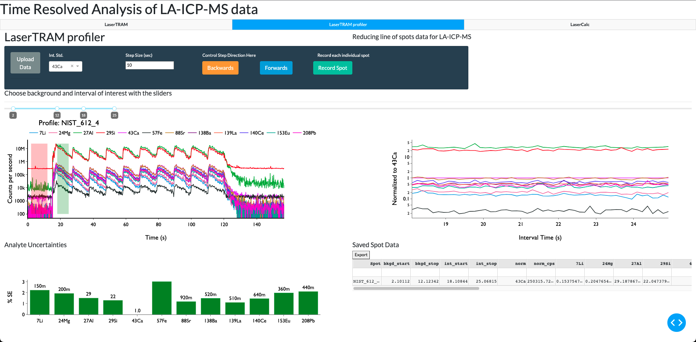
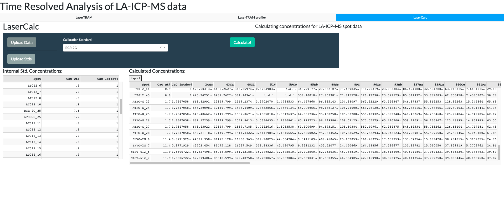

# LaserTRAM-DB: A dashboard for the complete laser ablation icp-ms data reduction pipeline. 

LaserTRAM-DB is a dashboard for the complete processing pipeline of Laser Ablation Inductively Coupled Plasma Mass Spectrometry (LA-ICP-MS) data in complex materials such as geologic samples. As LA-ICP-MS data in geologic samples frequently have multiple phases, inclusions, and other compositional complexities within them that do not represent the material of interest, user interaction is required to filter unwanted signals out of the overall ablation signal. LaserTRAM-DB allows the user to filter which portion of the ablation peak is utilized in calculating concentrations, subsequently allowing for more accurate data to be obtained. Furthermore, it allows for the processing of both individual spot analysis data and a line of spots gathered in rapid succession, reducing the time required for data reduction while preserving spatial definition and still ensuring data quality.

It is comprised of 3 parts: 
1. **LaserTRAM:** Choosing an interval of interest from raw cps data in individual spot analyses and normalizing it to an internal standard.



2. **LaserTRAM profiler:** Functionally the same as LaserTRAM, however has tools that allow for the rapid inspection of a line of spot analyses gathered in quick succession.



3. **LaserCalc:** Takes the output from either LaserTRAM or LaserTRAM profiler and converts the normalized data into concentrations using the equations outlined below.



# Installation and Use

The easiest way to use LaserTRAM-DB is to use the following link: 

[lasertram-db.herokuapp.com](https://lasertram-db.herokuapp.com/)

Alternatively, LaserTRAM-DB can be installed locally and run by creating a [virtual environment](https://packaging.python.org/guides/installing-using-pip-and-virtual-environments/#installing-virtualenv):

```
git clone https://github.com/jlubbersgeo/laserTRAM-DB
cd /path/to/laserTRAM-DB
python3 -m venv lasertram-db
source ./lasertram-db/bin/activate
pip3 install -r ./requirements.txt
python lasertram-db.py
```

When the program is running, copy and paste the provided link provided in the terminal window into the browswer window and the app will run. 

You can close the program by entering ```ctrl + c``` in the terminal window. Any time from here on out simply navigate to the folder where the repository is cloned:
```
cd /path/to/laserTRAM-DB
python lasertram-db.py
```


# Demos
Video tutorials on how to use each piece of software can be found at the following links:

- [LaserTRAM video](https://www.youtube.com/watch?v=ALVzTdMnS-k&t=338s&ab_channel=JordanLubbers)
- [LaserTRAM profiler video](https://youtu.be/x6FINd_jvps)
- [LaserCalc video](https://www.youtube.com/watch?v=vWmwE5XO5l0&t=1s&ab_channel=JordanLubbers)

# Quickstart

To get started, please watch the videos above in the Demos section. After that, sample data may be found in the "tests" folder:
- LaserTRAM test data: ```spot_test_raw_data.xlsx```
- LaserTRAM profile test data: Any of the following files: ```ATHO-G-7.csv```, ```BCR-2G-12.csv```,```BCR-2G-1.csv```,```BHVO-2G-3.csv```,```unknown_nist.csv```
- LaserCalc test data: ```spot_test_lasertram_complete.xlsx```,```profile_test_lasertram_profiler_complete.xlsx```


Please reach out to Jordan Lubbers (lubbersj@oregonstate.edu) with any questions.

